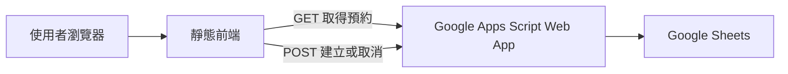

# 會議室預約系統

這是一個以公司內部使用為主的會議室預約系統，目前用於管理「服務大樓 405 會議室」的預約、查詢與取消。前端由原生 HTML、CSS 與 JavaScript 組成，後端使用 Google Apps Script，並將預約資料儲存在 Google Sheets。

## 主要功能

- 顯示會議室容量、設備、可選開始時間與午休時段。
- 填寫申請單位、姓名、電子郵件及會議名稱。
- 從日期欄位或行事曆選擇預約日期。
- 選擇開始時間與預約時長，自動計算結束時間。
- 阻擋跨越午休時段或與既有預約重疊的申請。
- 點選行事曆日期後，依開始時間顯示當日預約。
- 當日預約會顯示起訖時間、完整會議名稱與預約者完整姓名。
- 使用電子郵件查詢個人預約，並透過確認對話框取消預約。
- 支援桌面、平板與行動裝置的響應式版面。
- 使用語意化 HTML、鍵盤操作、焦點樣式與 live region 提升可存取性。

## 會議室資訊

| 項目 | 說明 |
| --- | --- |
| 會議室 | 服務大樓 405 |
| 容納人數 | 10 人 |
| 設備 | 投影儀、白板 |
| 可選開始時間 | 09:00–16:30，以 30 分鐘為間隔 |
| 午休時間 | 12:30–13:30 不開放 |
| 預約時長 | 0.5–4 小時 |

## 使用流程

### 建立預約

1. 進入「預約會議室」頁面。
2. 填寫申請單位、姓名、電子郵件與會議名稱。
3. 選擇預約日期、開始時間與時長。
4. 檢查頁面上的預約摘要與當日已預約時段。
5. 點選「確認預約」，系統會驗證必填欄位、email 格式、午休衝突與時段重疊。
6. 送出成功後，頁面會顯示預約摘要。

### 查詢與取消預約

1. 進入「查詢／取消預約」頁面。
2. 輸入建立預約時使用的電子郵件。
3. 從查詢結果選擇要取消的預約。
4. 在確認對話框檢查會議名稱、日期與時間，再確認取消。

## 系統架構



- **前端：**原生 HTML、CSS 與 JavaScript，可由 Nginx 或其他靜態網頁伺服器托管。
- **API：**Google Apps Script Web App，使用 JSON 格式處理預約查詢、建立與取消。
- **資料儲存：**Google Sheets，每一列代表一筆預約。

## 專案結構

| 檔案 | 用途 |
| --- | --- |
| `index.html` | 系統首頁、會議室資訊與快速入口 |
| `reservation405.html` | 會議室預約表單、預約摘要與行事曆 |
| `cancel.html` | 預約查詢、結果清單與取消確認對話框 |
| `script.js` | 應用狀態、事件處理、表單驗證、行事曆、預約邏輯與 API 存取 |
| `styles.css` | 全站視覺、元件狀態、響應式與可存取性樣式 |

## 前端設定

`script.js` 內的 `App.config.GAS_URL` 必須指向已部署的 Google Apps Script Web App：

```javascript
config: {
    GAS_URL: "https://script.google.com/macros/s/YOUR_DEPLOYMENT_ID/exec",
}
```

變更 Apps Script 部署後，請同步更新此 URL。不要將存取憑證、私密 token 或服務帳號金鑰寫入前端檔案。

## Google Sheets 資料結構

後端預期工作表第一列為標題，後續每列為一筆預約，欄位順序如下：

| 欄位 | 說明 | 範例 |
| --- | --- | --- |
| `id` | 預約唯一識別碼 | `res-1720000000000` |
| `timestamp` | 建立時間 | Google Sheets 日期時間 |
| `unit` | 申請單位 | `資訊處` |
| `meetingName` | 會議名稱 | `每週進度會議` |
| `name` | 預約者姓名 | `王小明` |
| `email` | 查詢與取消使用的 email | `user@example.com` |
| `date` | 預約日期 | `2026-07-17` |
| `time` | 開始時間 | `09:00` |
| `duration` | 時長，單位為小時 | `1.5` |

Apps Script 專案的時區必須與實際使用地區一致，否則日期與時間格式化可能產生偏差。

## API 契約

### 取得所有預約

```http
GET GAS_URL
```

成功時回傳預約陣列：

```json
[
  {
    "id": "res-1720000000000",
    "timestamp": "2026-07-17T01:00:00.000Z",
    "unit": "資訊處",
    "meetingName": "每週進度會議",
    "name": "王小明",
    "email": "user@example.com",
    "date": "2026-07-17",
    "time": "09:00",
    "duration": 1
  }
]
```

### 建立預約

```json
{
  "action": "addReservation",
  "unit": "資訊處",
  "meetingName": "每週進度會議",
  "name": "王小明",
  "email": "user@example.com",
  "date": "2026-07-17",
  "time": "09:00",
  "duration": 1
}
```

### 取消預約

```json
{
  "action": "deleteReservation",
  "id": "res-1720000000000"
}
```

POST 請求使用 `text/plain;charset=utf-8` 傳送 JSON，以降低瀏覽器對 Apps Script Web App 發出 preflight 請求的機會。

## 本機啟動

這是靜態前端，不需要安裝 npm 套件或執行建置步驟。不建議以 `file://` 直接開啟 HTML，請使用本機 HTTP 伺服器。

### 使用 Nginx

1. 將 repository 放在 Nginx 的 `html` 目錄下。
2. 啟動 Nginx。
3. 開啟對應網址，例如：

```text
http://localhost/meeting-room-booking/
```

Windows 環境可在 Nginx 根目錄執行：

```powershell
Start-Process -FilePath .\nginx.exe -WindowStyle Hidden
```

停止 Nginx：

```powershell
.\nginx.exe -s stop
```

## 部署

### 前端

可將 repository 內的靜態檔案部署到 Nginx、Apache、GitHub Pages 或任何支援靜態網站的托管服務。部署前請確認：

- `script.js` 中的 `GAS_URL` 已指向正確環境。
- 部署網站可透過 HTTPS 存取。
- Google Apps Script Web App 的存取範圍符合組織安全政策。
- 已實際驗證預約、查詢與取消流程。

### Google Apps Script

1. 建立 Google Sheet，並依「Google Sheets 資料結構」建立標題列。
2. 建立與試算表連結的 Apps Script 專案。
3. 實作 `doGet()` 取得預約，以及 `doPost()` 處理 `addReservation` 與 `deleteReservation`。
4. 將 Apps Script 部署為 Web App，並依組織規範設定執行者與存取範圍。
5. 將部署後的 `/exec` URL 填入 `App.config.GAS_URL`。

## 姓名顯示與缺值規則

行事曆的當日預約清單使用以下規則：

| 原姓名 | 顯示結果 |
| --- | --- |
| `王小明` | `王小明` |
| `歐陽小明` | `歐陽小明` |
| ` 王明 ` | `王明` |
| `王` | `王` |
| 空白或缺少 | `未知姓名` |

姓名會先移除前後空白，再以完整文字顯示。會議名稱為空白或缺少時顯示「未命名會議」。當日預約清單不顯示 email 或申請單位。

## 安全與限制

- 前端的時段衝突檢查只能提供即時操作回饋，不能取代後端的權威驗證。
- 若 Apps Script 後端沒有在寫入時重新驗證衝突與使用鎖定，同時預約可能產生競態條件。
- 以 email 查詢或取消預約不等於完整的使用者身分驗證。對外開放前，應在後端實作身分驗證與授權。
- API 回傳資料包含預約者完整姓名與 email，本系統目前僅供公司內部使用。前端顯示規則不是資料層存取控制；若未來對外開放，應先實作身分驗證與授權，或恢復姓名遮罩。
- 不應將技術錯誤、Apps Script stack trace、試算表名稱或其他內部資訊直接顯示給一般使用者。
- 正式上線前，應依組織需求補上後端資料驗證、存取控制、原子衝突檢查與操作紀錄。

## 手動驗證清單

- [ ] 首頁可正常導向預約頁與查詢／取消頁。
- [ ] 預約資料可成功載入，載入失敗時有明確錯誤訊息。
- [ ] 必填欄位與 email 格式驗證正常。
- [ ] 午休衝突與既有預約重疊可被阻擋。
- [ ] 點選有預約的日期後，預約清單顯示正確時間、會議名稱與完整姓名。
- [ ] 姓名會移除前後空白並完整顯示，空白姓名顯示「未知姓名」。
- [ ] 缺少會議名稱或姓名時，仍顯示占用時段與對應 fallback。
- [ ] 長會議名稱在桌面與 `320px` 寬度下皆不會水平溢位。
- [ ] 日期欄位、行事曆、表單與取消對話框可以使用鍵盤操作。
- [ ] 送出、查詢與取消的 loading、success、error 狀態可被正確感知。

## 瀏覽器與可存取性目標

- Chrome 與 Microsoft Edge 最新穩定版。
- WCAG 2.2 AA 為設計與實作目標。
- 支援鍵盤導覽、`200%` 縮放、Windows High Contrast 與 `prefers-reduced-motion`。

## 後續改善方向

- 在後端實作原子化時段衝突檢查。
- 新增使用者身分驗證、授權與審計記錄。
- 將日期、時間與預約邏輯拆成可獨立測試模組。
- 建立自動化單元測試、DOM 測試與端到端測試。
- 新增多會議室、權限與管理功能。
